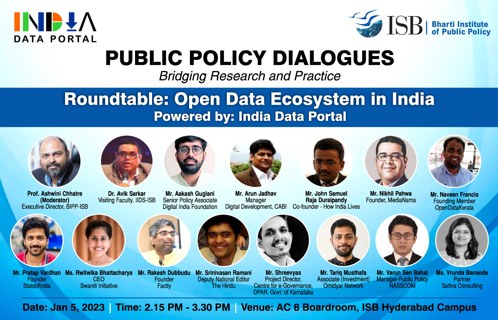
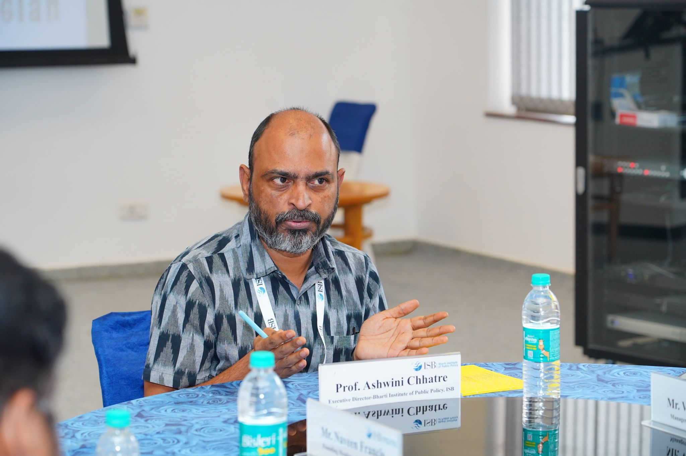
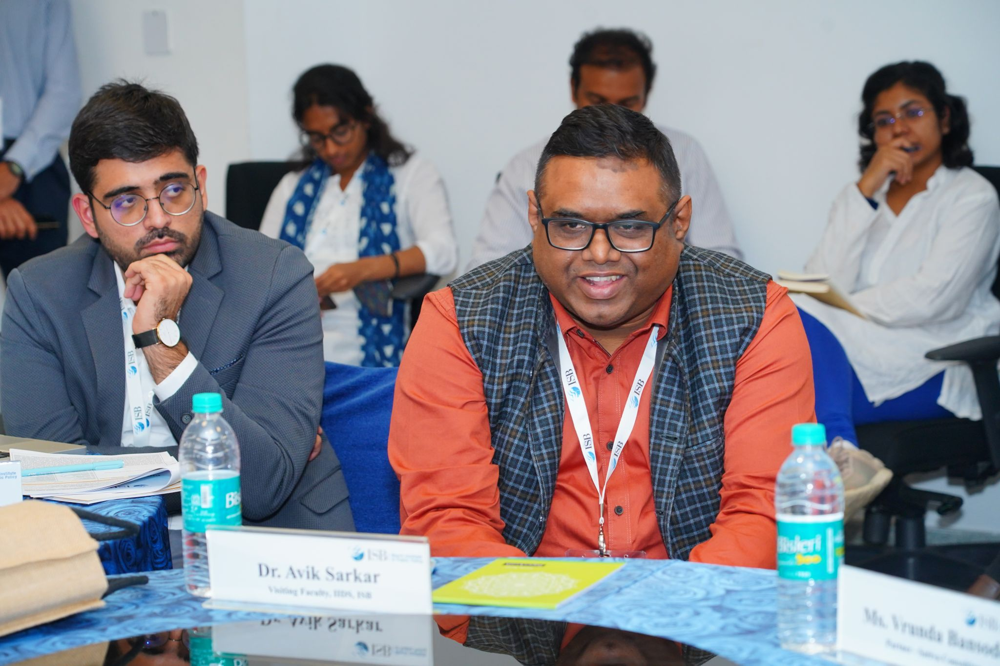
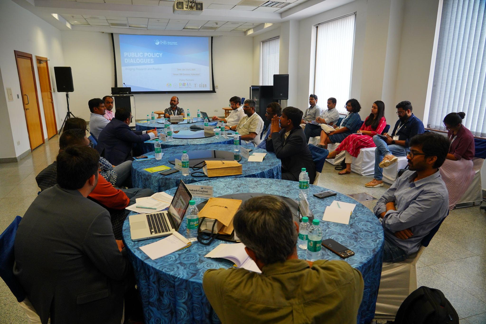
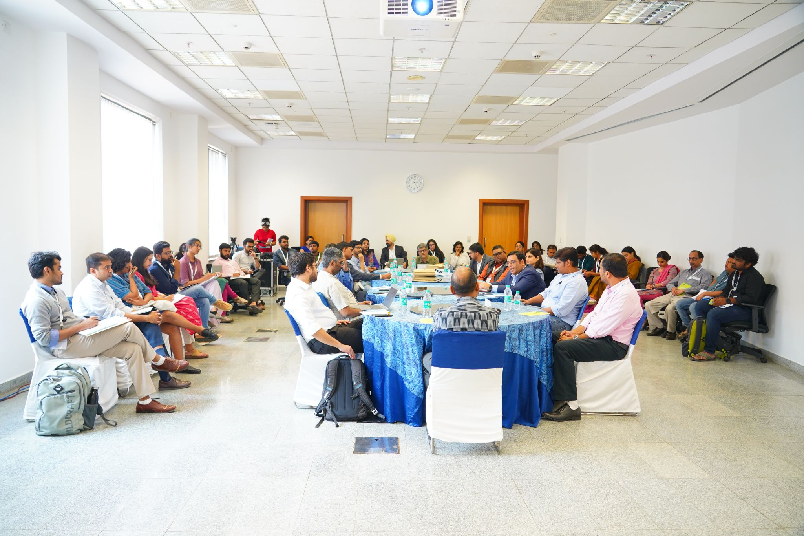
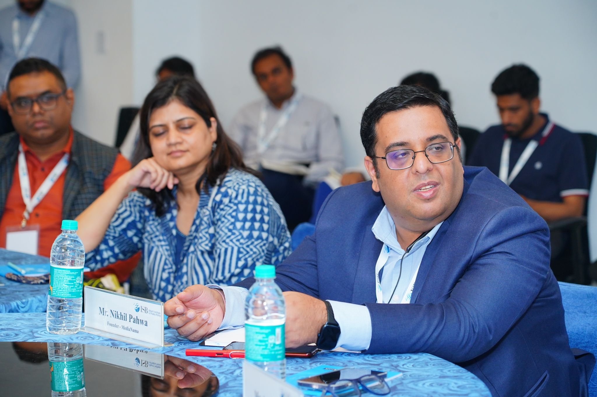
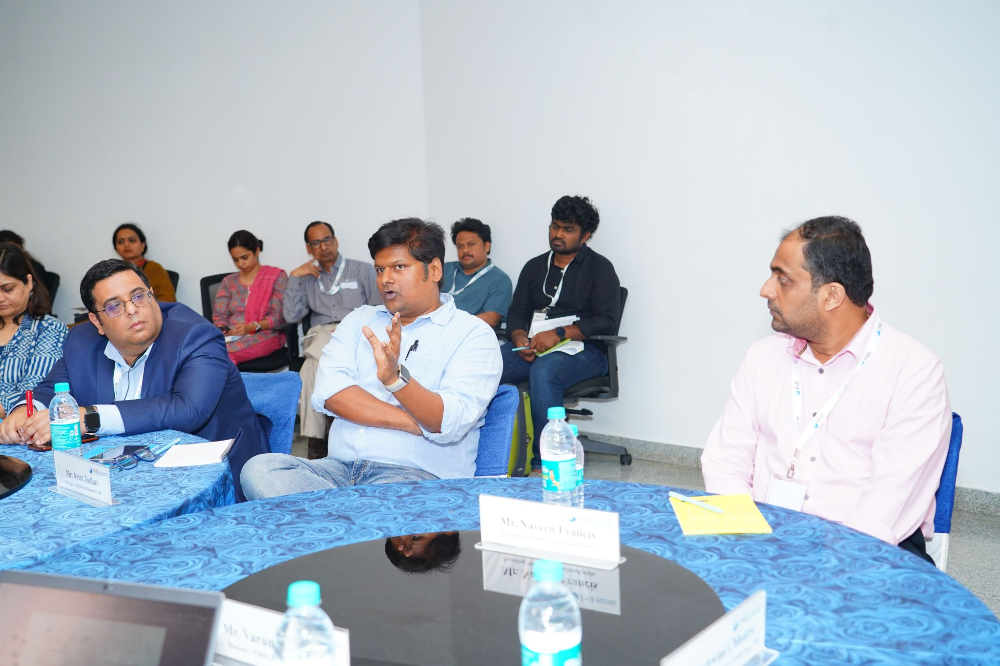

A roundtable discussion on the "Open Data Ecosystem in India" was held on January 5, 2023, from 2:15 PM to 3:30 PM at the AC 8 Boardroom, ISB Hyderabad Campus. The event was powered by the India Data Portal and aimed to bridge the gap between research and practice in public policy dialogues.

**Moderator**:
-  Prof. Ashwini Chhatre - Executive Director, BIPP-ISB

**Panelists**:
The panel featured a diverse group of experts from academia, policy, and practice, including:

- Dr. Avik Sarkar - Visiting Faculty, IIDS-ISB
- Mr. Aakash Guglani - Senior Policy Associate, Digital India Foundation
- Mr. Arun Jadhav - Manager, Digital Development, CABI
- Mr. John Samuel Raja Duraipandy - Co-founder, How India Lives
- Mr. Nikhil Pahwa - Founder, MediaNama
- Mr. Naveen Francis - Founding Member, OpenDataKerala
- Mr. Pratap Vardhan - Founder, StatsofIndia
- Ms. Rwitwika Bhattacharya - CEO, Swaniti Initiative
- Mr. Rakesh Dubbudu - Founder, Factly
- Mr. Srinivasan Ramani - Deputy National Editor, The Hindu
- Mr. Shreevyas - Project Director, Centre for e-Governance, DPAR, Govt. of Karnataka
- Mr. Tariq Musthafa - Associate (Investment), Omidyar Network
- Mr. Varun Sen Bahal - Manager-Public Policy, NASSCOM
- Ms. Vrunda Bansode - Partner, Sattva Consulting

