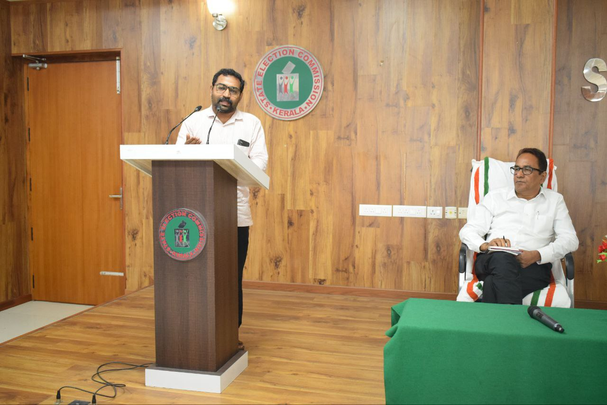
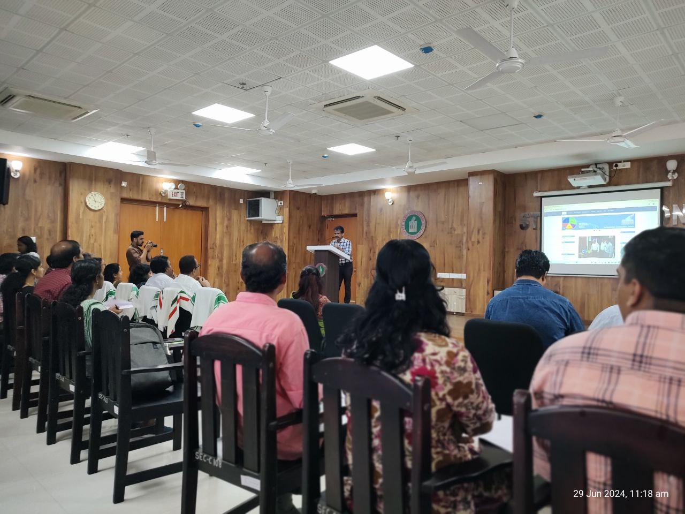
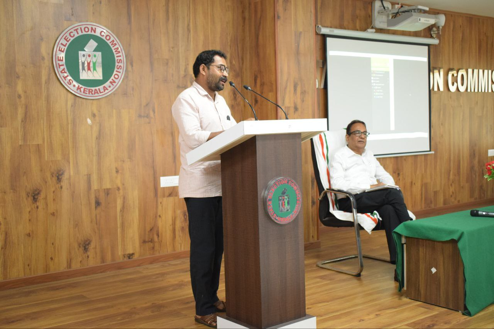

I received a letter from the Secretary, State Election Commission, Kerala, on 22/06/2024, inviting me to a workshop scheduled to be conducted on 29th June at the headquarters of SEC, in Thiruvananthapuram. The letter stated that, The State Election Commission has decided to go ahead with digital mapping of constituencies and wards of all the LSGIs of the state. In order to carry out the activity at field level, it has been decided to conduct a one day workshop and to finalize its Standard Operating Procedure (SOP). All the district level Joint Directors of LSGD, and the State as well as district level Technical Officers of Information Kerala Mission were the other invitees. I have participated in the workshop. 

The methodology for surveying and collecting the ward boundary data of each local authorities, framed by Information Kerala Mission was presented by the IKM officials before the State Election Commission, and the invitees. The field survey will be done using the mobile app QField for QGIS. A hands on training including field data collection was also conducted. Each district level official got the opportunity to comment on the methodology.

Me too got the opportunity to comment. The Commission already knows about, our pioneering mapping effort done at Koorachundu Grama Panchayat back in 2014. I described our Koorachundu methodology of mapping to the commission and requested that, when maps got finalised and authorised, it would be beneficial to everyone if the maps and map data were made openly available under a permissive license. I also described the major huddles the Koorachundu Grama Panchayat had to face to get the map data at the finger tip, when in need. I also, reiterated that the forest lands also to be included while drawing ward boundaries, otherwise in case of disasters or mishaps it would be difficult to coordinate rescue operations under the local authorities machinery to rescue. And,  it would be equally difficult to handle the activities under the building rules at LSGI levels. The honourable commission responded positively. The workshop concluded in the evening.

- Jaisen Nedumpala, 
Secretary, Panangad Grama Panchayat.

