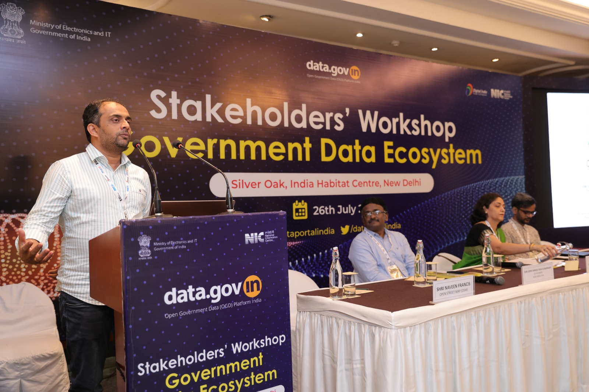
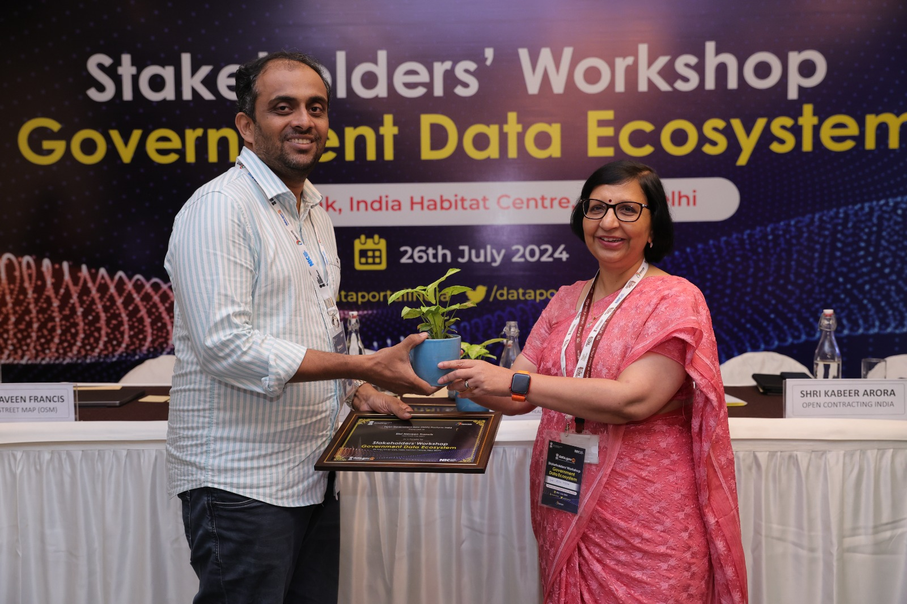
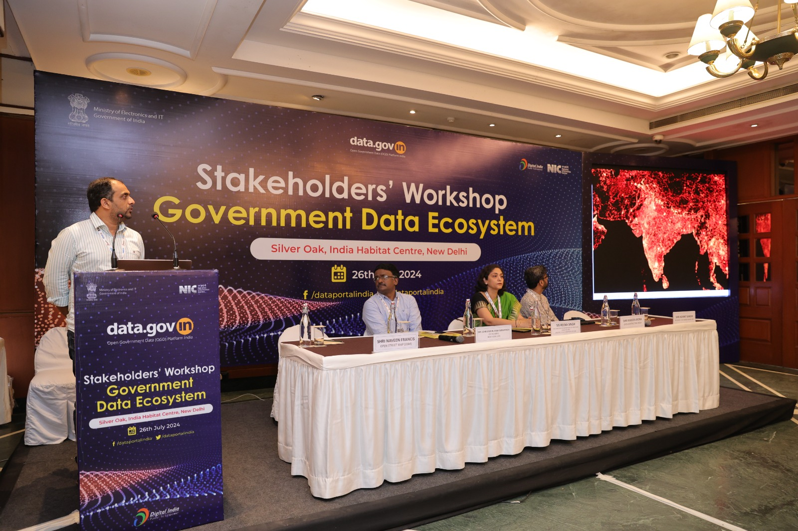
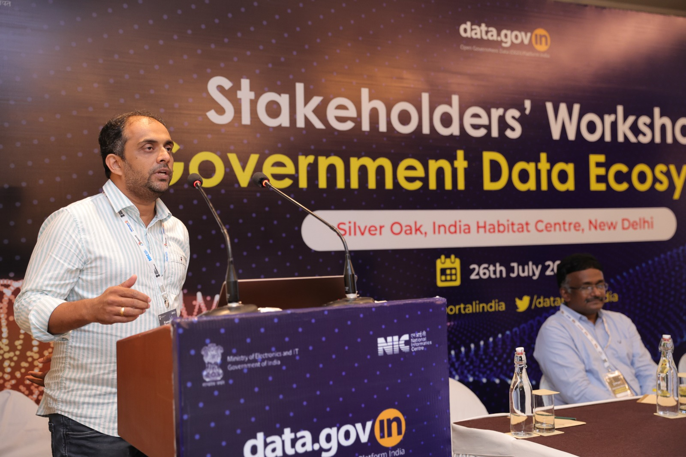
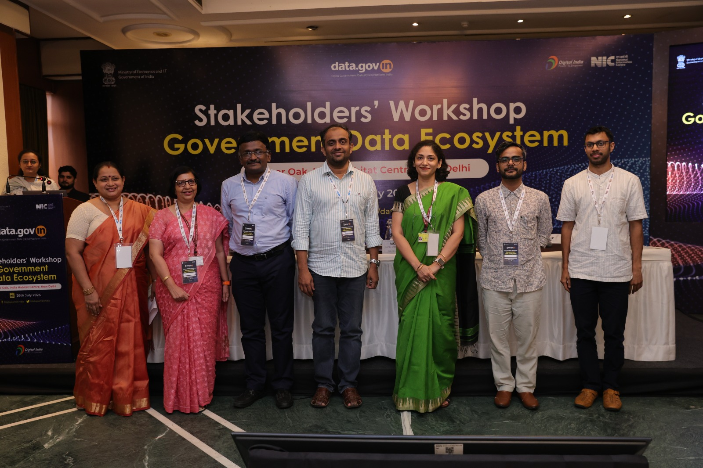
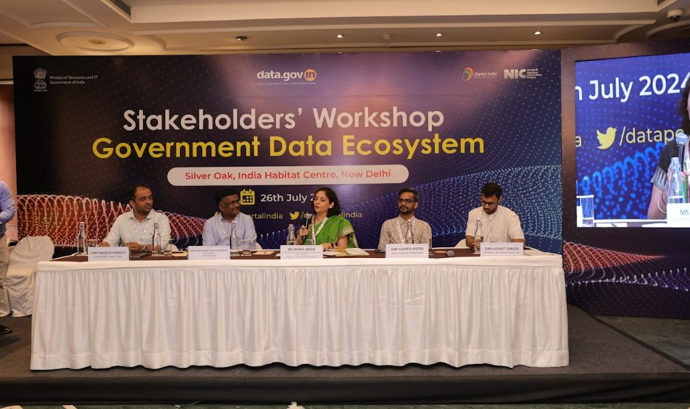

A Stakeholders’ Workshop was organized by [Open Government Data (OGD) Platform India](https://data.gov.in) on 26th July 2024 at the Indian Habitat Centre, New Delhi. Naveen Francis, representing OpenDataKerala participated in the workshop . He also delivered a talk on OpenStreetMap India and activities of OpenDataKerala and how it helped to develop an opendata eco system in Kerala.  

- View/Download the Presentation here 
PDF
Presentation
-------------------------------------------

