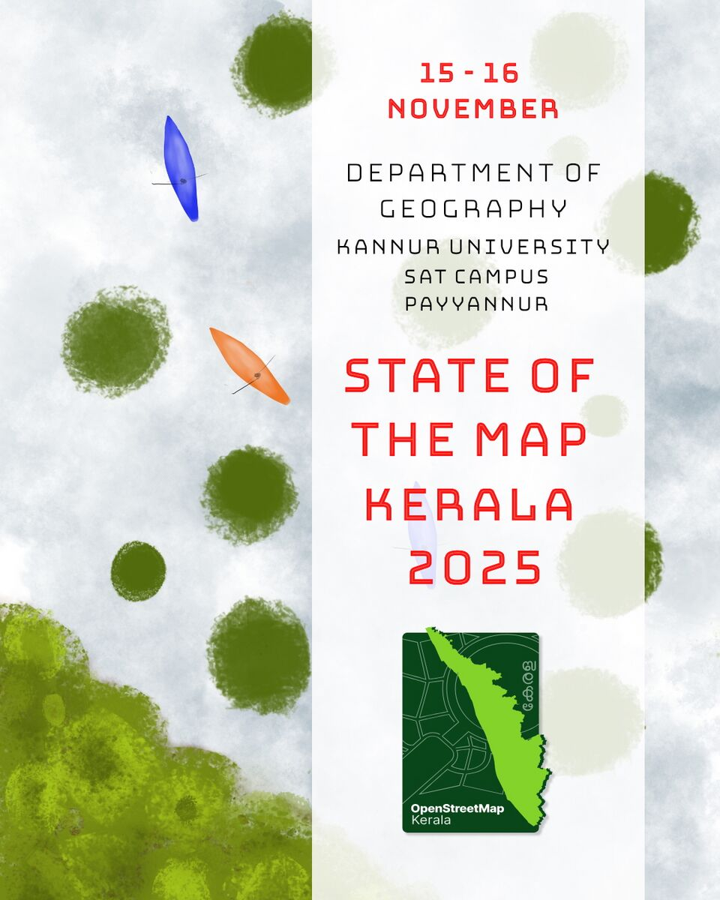

## 📢 Join Us for SOTM Kerala 2025 🌍📊

Welcome to the Annual Gathering of Kerala’s Mapping Enthusiasts!

Join us for two exciting days filled with learning, sharing, and collaboration as we work together to shape the future of mapping in Kerala. 

The Second Edition of State of the Map Kerala and fourth edition of Openstreetmap Kerala Commuity meetup is happening on Nov 15,16 2025 at Department of Geography, Kannur University (Swami Anandatheertha Campus, Payyannur) 

### 📅 Date: November 15 - 16, 2025

### 📍 Venue: Kannur University (Swami Anandatheertha Campus, Payyannur)

### [Register Here](https://app.makemypass.com/event/sotm-kerala-2025)

More Details at: [OSM WIKI](https://wiki.openstreetmap.org/wiki/State_of_the_Map_Kerala_2025)
