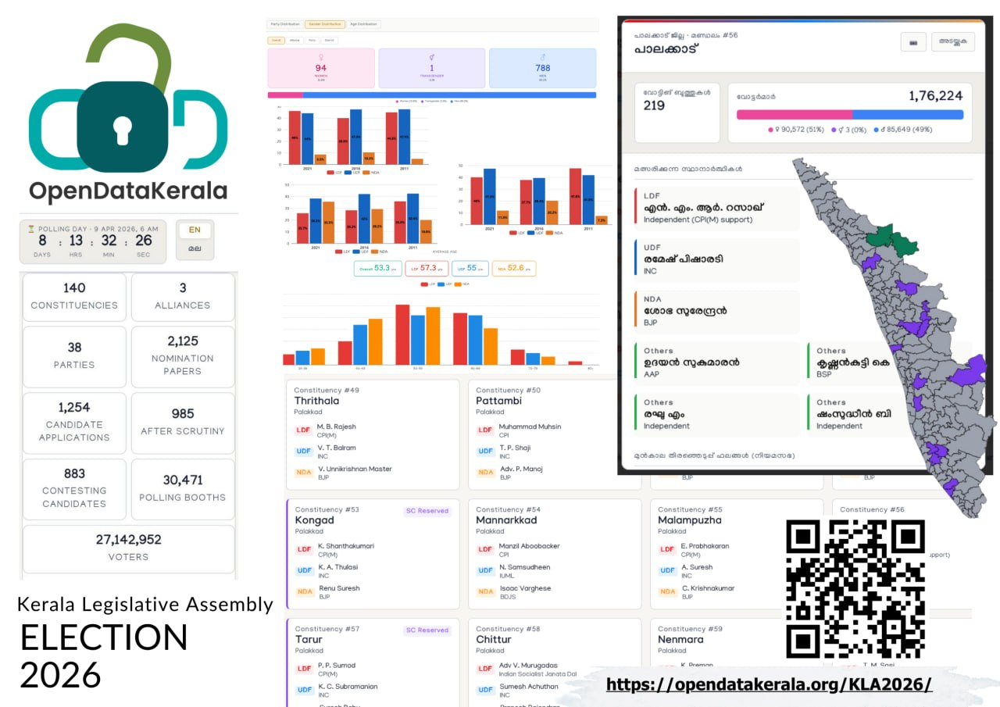

Explore the Kerala Assembly Election 2026 Portal by the OpenDataKerala Community 

## [Visit Page](https://opendatakerala.org/KLA2026/)

This platform brings together curated, constituency-wise election insights for the public, researchers, journalists, and political workers. Built as a community-driven open data initiative, it transforms complex election information into transparent, accessible, and reusable knowledge for everyone.

From structured datasets to interactive maps, the portal offers rich features including voter demographics, party distribution, candidate details, and historical election data from 2011, 2016, and 2021. With powerful filters and intuitive visualizations, users can easily explore trends, compare results, and gain deeper insights—strengthening informed participation in democracy.