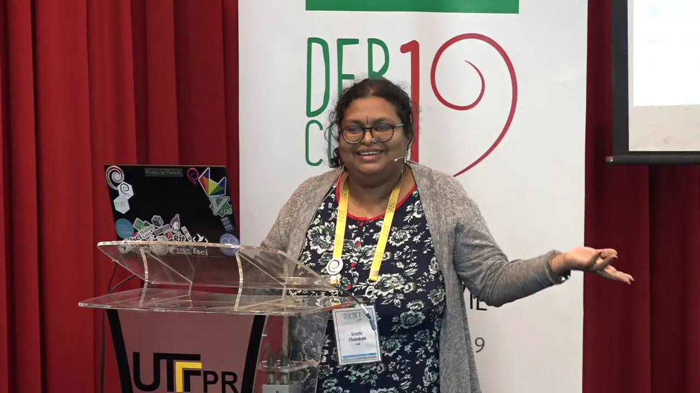

Sruthi Chandran was elected as the Debian Project Leader in the recent election, becoming the **first woman** and **first Asian** to hold this position. 

The new term for the project leader starts on April 21, 2026 and will expire on April 20, 2027. The Debian Project Leader (DPL) is the person elected annually by Debian developers to act as the project's public representative, coordinate community-wide decisions and initiatives, resolve disputes or escalate issues, oversee administrative tasks, and facilitate collaboration across teams.

Sruthi Chandran hailing from Kannur, Kerala  was a librarian at TCS who later joined the Debian Project. Since 2020, Sruthi was contesting for the DPL election and this year Debian community chose Sruthi as the leader for the project. She currently resides in Mumbai with her husband who is also a Debian Developer from Kerala. In her free time she enjoys baking and reading books.

She started contributing to Debian from 2016 and became an official member (Debian Developer) in 2018. Before becoming DPL, she was part of Debian Community team which mediates when there are conflicts among developers, DebConf committee, which provides guidance for organizing DebConf around the world every year and Debian Outreach team, which works on bringing new contributors to Debian.

Sruthi had a vital role in bringing the annual Debian conference, DebConf to India in year 2023.  She was also the chief organizer of the two week long international event hosted at Infopark, Kochi. The event had over 200 attendees from around the world.

Being a Free and Open Source Software advocate and Communicator, she led sessions in various national as well as international events and conferences and is a widely known person in the Free software community. Through these events she inspired many women to contribute to FOSS projects.

Along with FOSS contributions, she is also an active contributor of 

------------------------------------------
_News matter prepared by Debian contributors_

